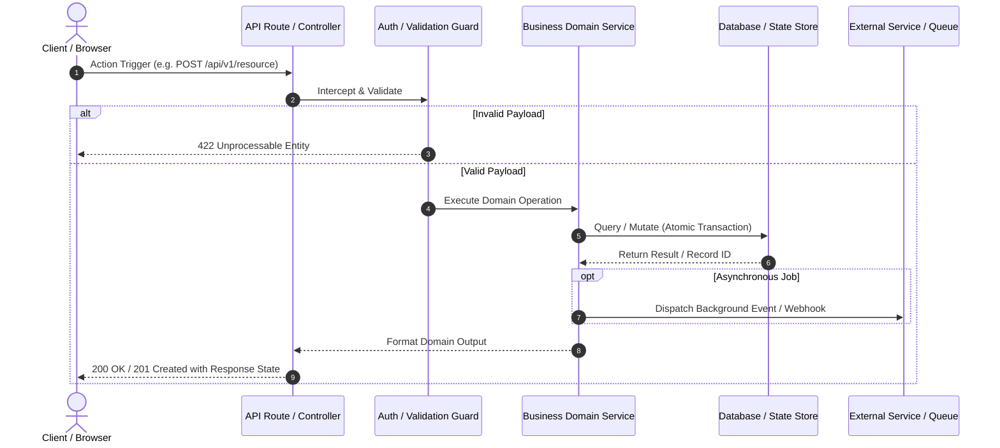

# Flow Simulation Skill (All-in-One Edition) 🔄

> **Single-File Complete Edition**: Contains the entire Flow Simulation protocol, reference checklists, simulation techniques, end-to-end case studies, and diagram templates in one copy-pasteable document. Perfect for single-file IDE rules, custom GPTs, project knowledge bases, or standalone system prompts.

---

## Table of Contents
1. [Core Philosophy & Why This Exists](#1-core-philosophy--why-this-exists)
2. [The 5-Phase Flow Simulation Protocol](#2-the-5-phase-flow-simulation-protocol)
3. [Flow Tracing Audit Checklist](#3-flow-tracing-audit-checklist)
4. [Simulation Techniques & State Transition Modeling](#4-simulation-techniques--state-transition-modeling)
5. [Real-World Case Study 1: Signup & Authentication Flow](#5-real-world-case-study-1-signup--authentication-flow)
6. [Real-World Case Study 2: Payment Checkout & Webhook Race Condition](#6-real-world-case-study-2-payment-checkout--webhook-race-condition)
7. [Flow Diagram & Reporting Templates](#7-flow-diagram--reporting-templates)

---

## 1. Core Philosophy & Why This Exists

A notorious failure mode of AI coding models is **"shallow patching"**:
- When a user asks: *"Fix the bug on the signup screen where the submit button hangs,"* a standard AI model often inspects only the frontend component, removes a loading state check or comments out a validation, and marks the task complete.
- In reality, the button hung because an upstream API route returned an unexpected error format, which failed a token parser, which broke session creation, which caused an unhandled promise rejection. The shallow fix leaves the user's data corrupted and breaks adjacent flows (such as login or OAuth).

The **Flow Simulation** skill trains the AI model to behave like a senior systems engineer:
1. **Trace the entire route** from user input through middleware, business logic, databases, third-party APIs, and final client state.
2. **Map the blast radius** to understand every upstream caller and downstream consumer that touches that flow.
3. **Simulate the execution paths mentally** (happy path, failure path, edge cases) before modifying code.
4. **Implement surgical, contract-preserving fixes**.
5. **Re-simulate the entire flow end-to-end** and verify that no connected routes or adjacent features have regressed.

---

## 2. The 5-Phase Flow Simulation Protocol

Whenever a task touches any interconnected logic, route, or workflow, follow this protocol sequentially:

```
[Phase 1: Flow Identification & Route Discovery]
                     │
                     ▼
[Phase 2: Interaction & Blast Radius Mapping]
                     │
                     ▼
[Phase 3: Pre-Fix Flow Simulation]
                     │
                     ▼
[Phase 4: Contract-Preserving Implementation]
                     │
                     ▼
[Phase 5: Post-Fix Flow Simulation & Verification]
```

### Phase 1: Flow Identification & Route Discovery
Before editing any file, map the entire journey:
1. **Identify the Trigger Entry Point**:
   - Client/UI event (e.g. form submit button, URL router, hook, form action).
   - Network API route (e.g. HTTP POST `/api/v1/auth/signup`, GraphQL mutation, gRPC method).
   - Event trigger (e.g. message queue topic, webhook listener, cron schedule).
2. **Trace the Ingestion & Pipeline Route**:
   - Route handlers & controllers.
   - Middlewares (auth guards, rate limiters, validation schemas, session parsers).
   - Business services and domain logic.
   - External dependencies (databases, cache layers, third-party APIs, email providers, payment gateways).
3. **Trace the Settlement & Response Route**:
   - Return payloads, status codes, and headers.
   - Client state updates, cookies, session storage, and route redirects.
   - Background side effects (async dispatch, analytics events, notification queues).

### Phase 2: Interaction & Blast Radius Mapping
Examine every component that interacts with the target code:
1. **Upstream Invariants**:
   - Who calls this function or route?
   - What data shapes, types, headers, or parameters does upstream code guarantee or assume?
2. **Downstream Dependencies**:
   - What other services or consumers rely on the output of this function?
   - If the return format or error shape changes, what downstream clients or jobs fail?
3. **State & Storage Mutability**:
   - What database tables, cache keys, or local state tokens are read, written, or locked during this flow?
   - Can this flow fail midway leaving orphaned or corrupted state (lack of transaction/rollback)?
4. **Shared Utilities & Cross-Cutting Concerns**:
   - If a shared utility or helper is changed, what unrelated flows also invoke it?

### Phase 3: Pre-Fix Flow Simulation
Perform a mental dry-run and step-by-step execution analysis before authoring code:
1. **Simulate the Happy Path**: Step through execution with valid, ideal inputs. Track variable states, schema validations, DB queries, session states, and redirect destinations.
2. **Simulate the Failure Path (Recreate the Bug)**: Inject the specific inputs or conditions that cause the user's reported problem. Pinpoint the exact point in the pipeline where the contract, invariant, or expectation breaks.
3. **Simulate Edge Cases & Failure Modes**: Empty/null inputs, network timeouts, duplicate records, race conditions, expired tokens.

### Phase 4: Contract-Preserving Implementation
Write the code fix with strict preservation of existing contracts:
1. **Surgical Precision**: Fix the root cause at the correct abstraction layer—not through superficial workarounds in downstream consumers.
2. **Maintain Data Contracts**: Do not alter existing return types, API response schemas, or exception types unless explicitly agreed upon. Ensure backward compatibility.
3. **Atomic Error Handling & Rollbacks**: Ensure exceptions at any step cleanly rollback partial changes (database transactions, cleanup of temporary tokens).

### Phase 5: Post-Fix Flow Simulation & Verification
Never finish without validating the complete chain:
1. **Simulate the Resolved Flow**: Step through the exact scenario that previously failed. Confirm that the issue is resolved cleanly at each layer.
2. **Simulate Surrounding Flows (Regression Prevention)**: Walk adjacent flows that touch the same services, helpers, or database models (e.g. for an auth fix, verify login, password reset, session refresh, and token verification).
3. **Execute Automated Tests & End-to-End Verification**: Run unit, integration, and E2E test suites (`npm test`, `pytest`, `cargo test`, etc.).
4. **Communicate Clearly with a Flow Map**: Summarize the traced flow, the pinpointed issue, and the verified resolution using a concise diagram.

---

## 3. Flow Tracing Audit Checklist

Use this checklist whenever evaluating a bug or modification that spans multiple layers:

### A. Trigger & Ingestion
- [ ] **Trigger Source**: User-driven (button, form), system-driven (cron, webhook), or message-driven (queue, event bus)?
- [ ] **Input Parsing**: Where is the incoming payload parsed or deserialized? Are types coerced or validated?
- [ ] **Middlewares**: Auth/session guards, role permissions, request schema validation (Zod, Pydantic), rate limits, CORS headers.

### B. Business Logic & Services
- [ ] **Domain Entity State**: What business rules govern the transition? Are all preconditions checked?
- [ ] **Concurrency & Re-entrancy**: Can this flow be triggered twice simultaneously (e.g. double-clicking submit)? Is there idempotency?
- [ ] **Branching Logic**: Are all condition branches (`if / else`, `switch`, `match`) accounted for, including unhandled defaults?
- [ ] **Error Propagation**: Are errors thrown as typed domain exceptions, or are they swallowed/caught silently?

### C. Persistence & State
- [ ] **Database Reads/Writes**: Which tables, collections, or records are touched?
- [ ] **Transactions**: Are multi-step writes wrapped in an atomic database transaction?
- [ ] **Rollback Mechanisms**: If step 3 of 4 fails, is step 1 and step 2 cleaned up or rolled back?
- [ ] **Caching Layer**: Does this flow invalidate, update, or read from Redis/Memcached? Could stale cache break subsequent reads?

### D. External Integrations
- [ ] **Third-Party APIs**: Calls to Stripe, SendGrid, Twilio, OAuth providers, etc.
- [ ] **Timeout & Retry Policy**: How does the system react if the external service times out or returns HTTP 500/503?
- [ ] **Webhooks & Asynchronous Handshakes**: Does this action trigger an asynchronous callback? Will the system be ready to receive it?

### E. Settlement & Client State
- [ ] **Response Envelope**: Does the return payload match the expected format `{ success: true, data: ... }`?
- [ ] **HTTP Status**: Is the status code accurate (200, 201, 400, 401, 403, 404, 409, 422, 500)?
- [ ] **Session & Cookie Headers**: Are `Set-Cookie` attributes correct (`SameSite`, `Secure`, `HttpOnly`, `Path`, `Domain`)?
- [ ] **Client State Mutations**: How does the frontend store (Redux, Zustand, Pinia, React Query) react?
- [ ] **Client Navigation**: Is the user redirected to the correct route with required query parameters or route state?

### F. Regression & Blast Radius
- [ ] **Adjacent Workflows**: What other flows invoke the modified service/function/component?
- [ ] **Schema Changes**: Did any database column, API response property, or function argument signature change?
- [ ] **Existing Automated Tests**: Did all unit, integration, and E2E tests pass?

---

## 4. Simulation Techniques & State Transition Modeling

### The Dynamic State Table Technique
Build an internal state transition table to track variables across each step of the pipeline:

| Step | Action | Input State | Output / Mutation | Invariant / Expectation |
| :--- | :--- | :--- | :--- | :--- |
| **0. Form Submit** | User clicks submit | `email`, `password` | Client emits `POST /api/register` | Fields non-empty, valid format |
| **1. Middleware** | Rate limiter | IP: `192.168.1.1` | Counter incremented in Redis | Request under limit |
| **2. Validation** | Zod schema parse | Raw JSON body | Sanitized `{ email, password }` | Password meets strength requirements |
| **3. Duplicate Check**| Query DB for email | Sanitized email | DB returns `null` (not found) | Email unique |
| **4. Hash Password** | Argon2/Bcrypt hash | Raw password | `passwordHash` | Non-reversible, salt attached |
| **5. Insert User** | DB Transaction | `email`, `passwordHash` | New user record `id: 42` | Transaction open |
| **6. Create Session** | Session table insert | `userId: 42` | Session token `sess_xyz` | Session active |
| **7. Send Verification**| Queue email job | `userId: 42`, email | Message on queue | Async, does not block response |
| **8. Commit DB** | Commit transaction | Open transaction | Permanent record saved | Transaction closed |
| **9. HTTP Response**| Set Cookie & Return | `sess_xyz` | `Set-Cookie`, `{ ok: true }` | `HttpOnly`, `SameSite=Lax` |
| **10. UI Redirect** | Router push | `{ ok: true }` | Navigate to `/dashboard` | Protected route allows entry |

### Asynchronous & Race Condition Simulation
1. **Double-Click / Rapid Repeat**:
   - User taps "Complete Purchase" twice in 100ms.
   - Request A starts -> locks inventory -> processes payment.
   - Request B starts before Request A finishes -> checks inventory (looks available) -> duplicate payment!
   - *Remedy Identified*: Add database row-level locking or idempotent payment keys (`Idempotency-Key` header).
2. **Out-of-Order Responses**:
   - User types "re" (Request 1 sent, takes 400ms).
   - User types "react" (Request 2 sent, takes 150ms).
   - Request 2 returns first and populates UI with "react". Request 1 returns later and overwrites UI with outdated "re".
   - *Remedy Identified*: AbortController or sequence ID tracking.

---

## 5. Real-World Case Study 1: Signup & Authentication Flow

### Scenario
**User Request**: *"Users report that when they complete the signup form, the page spins for 10 seconds and then displays 'Network Timeout', but when they refresh and try to log in, it says their email is already registered."*

### ❌ Shallow AI Fix (BAD)
Opens `SignupForm.tsx`, changes `timeout: 10000` to `timeout: 30000`. The underlying backend stall remains, duplicate accounts accumulate in limbo, and users still cannot verify their accounts.

###  Flow Simulation Fix (GOOD)
1. **Phase 1 (Route Tracing)**:
   ```
   [SignupForm.tsx]
          │ (User submits email, password, name)
          ▼
   POST /api/v1/auth/signup (Route Handler)
          │
          ├─► [validateSignupInput] (Zod Schema Validation)
          ├─► [UserService.createPendingUser] (Inserts user status='PENDING')
          ├─► [TokenService.generateVerificationToken] (OTP in Redis)
          ├─► [EmailService.sendVerificationEmail] (Calls SMTP / Resend API)
          └─► [Response 201 Created] -> [Client navigates to /auth/verify-otp]
   ```
2. **Phase 2 (Interaction & Blast Radius)**:
   - Upstream: Web and mobile client submit endpoints.
   - Downstream: `UserRepository` (Postgres), `RedisCache` (OTP), `EmailService` (SMTP).
   - Shared: `EmailService.send()` is also used by `PasswordResetService`.
3. **Phase 3 (Pre-Fix Simulation)**:
   - Discovered: `EmailService.sendVerificationEmail` is `await`ed synchronously inside the HTTP handler.
   - The SMTP server has an unhandled retry loop that hangs for 10s before timing out.
   - The client cancels with "Network Timeout". Because user creation was committed without a transaction, the email remains locked as `'PENDING'`, blocking subsequent registration.
4. **Phase 4 (Contract-Preserving Implementation)**:
   - Offload email sending to background worker queue (BullMQ). Return HTTP 201 immediately once user and token are persisted.
   - Wrap user creation and token insertion in atomic DB transaction.
   - Handle pending duplicate registrations gracefully: resend token rather than throwing duplicate key violation.
5. **Phase 5 (Post-Fix Simulation & Verification)**:
   - User submits -> DB transaction commits in 15ms -> Background job enqueued -> HTTP 201 returned in under 100ms.
   - Re-simulated SMTP downtime: user registration succeeds, background worker retries email gracefully.
   - Ran `npm run test:auth` — all 14 tests passing.

---

## 6. Real-World Case Study 2: Payment Checkout & Webhook Race Condition

### Scenario
**User Request**: *"Some customers say their credit cards were charged, but their orders are stuck in 'Pending Payment' in our dashboard, and they didn't receive an order confirmation email."*

### Flow Simulation Fix
1. **Route Tracing**:
   ```
   [Customer Browser] -> [Stripe Hosted Checkout] -> Card Charged
          │                                                    │
          ├─► [Browser Redirect to /checkout/success]          └─► [Async Webhook to /api/webhooks/stripe]
          │   (Checks DB: status is still 'Awaiting_Payment')      (Updates DB status -> 'Paid')
          │   (Shows error: "Order not found or pending")          (Sends Confirmation Email)
   ```
2. **Blast Radius**: Webhook timing vs. client redirect race condition; duplicate webhook deliveries.
3. **Fix**:
   - Add webhook idempotency table (`idempotency_keys`) to reject duplicate Stripe event IDs.
   - On the `/checkout/success` page, if order is `'Awaiting_Payment'`, trigger a synchronous fallback call to `stripe.checkout.sessions.retrieve(sessionId)`. If paid, complete order in a transaction.
   - Atomic inventory decrement: `UPDATE inventory SET stock = stock - qty WHERE id = ... AND stock >= qty`.
4. **Verification**: Fast redirect scenario verified; duplicate webhook delivery verified; refund and cancellation webhooks verified.

---

## 7. Flow Diagram & Reporting Templates

### Mermaid Sequence Diagram Template


### ASCII Flow Pipeline Template
```text
[ Trigger: User Action / Webhook / Event ]
                   │
                   ▼
       [ Ingestion & Routing ]
       │ • URL Routing
       │ • Rate Limiter & Security Headers
       │ • Request Body Validation (Schema)
                   │
                   ▼
     [ Domain Business Logic ]
       │ • Preconditions Check
       │ • Entity State Transitions
       │ • Invariant Enforcement
                   │
         ┌─────────┴─────────┐
         ▼                   ▼
  [ Persistence ]     [ External APIs ]
  • DB Transaction    • Third-Party Calls
  • Cache Update      • Async Queue Push
         └─────────┬─────────┘
                   │
                   ▼
     [ Response & Client State ]
       • HTTP Status & Headers (Cookies)
       • Client State Mutation
       • Route Navigation / Redirect
```

### Blast Radius Impact Matrix
| Layer | Component / File | Role in Flow | Blast Radius / Potential Impact | Verified? |
| :--- | :--- | :--- | :--- | :---: |
| **Trigger** | `src/components/SignupForm.tsx` | Submits user credentials | Form validation, button loading state | Yes |
| **Route** | `src/app/api/auth/route.ts` | Handles POST request | Request parsing, response cookies | Yes |
| **Service** | `src/services/AuthService.ts` | Creates user, hashes pass | Shared by Login, Register, OAuth | Yes |
| **Storage** | `prisma/schema.prisma` (`User`) | Persists user record | Unique constraints on `email`, `username` | Yes |
| **Adjacent** | `src/services/PasswordReset.ts`| Sends reset tokens | Uses same token expiration helper | Yes |
