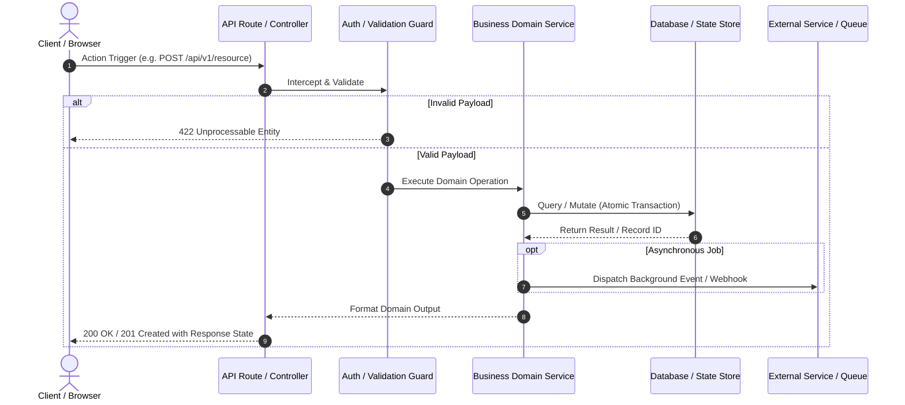

# Flow Diagram Templates

AI models and agents can use these pre-formatted templates to illustrate traced routes and simulation results to the user.

---

## 1. Mermaid Sequence Diagram Template

Use this template to illustrate request-response cycles, async events, and database operations.



---

## 2. ASCII Flow Pipeline Template

Use this lightweight template directly within chat responses when markdown rendering is limited.

```text
[ Trigger: User Action / Webhook / Event ]
                   │
                   ▼
       [ Ingestion & Routing ]
       │ • URL Routing
       │ • Rate Limiter & Security Headers
       │ • Request Body Validation (Schema)
                   │
                   ▼
     [ Domain Business Logic ]
       │ • Preconditions Check
       │ • Entity State Transitions
       │ • Invariant Enforcement
                   │
         ┌─────────┴─────────┐
         ▼                   ▼
  [ Persistence ]     [ External APIs ]
  • DB Transaction    • Third-Party Calls
  • Cache Update      • Async Queue Push
         └─────────┬─────────┘
                   │
                   ▼
     [ Response & Client State ]
       • HTTP Status & Headers (Cookies)
       • Client State Mutation
       • Route Navigation / Redirect
```

---

## 3. Blast Radius Impact Matrix

Use this markdown table template to present upstream and downstream blast radius analysis:

| Layer | Component / File | Role in Flow | Blast Radius / Potential Impact | Verified? |
| :--- | :--- | :--- | :--- | :---: |
| **Trigger** | `src/components/SignupForm.tsx` | Submits user credentials | Form validation, button loading state | Yes |
| **Route** | `src/app/api/auth/route.ts` | Handles POST request | Request parsing, response cookies | Yes |
| **Service** | `src/services/AuthService.ts` | Creates user, hashes pass | Shared by Login, Register, OAuth | Yes |
| **Storage** | `prisma/schema.prisma` (`User`) | Persists user record | Unique constraints on `email`, `username` | Yes |
| **Adjacent** | `src/services/PasswordReset.ts`| Sends reset tokens | Uses same token expiration helper | Yes |
